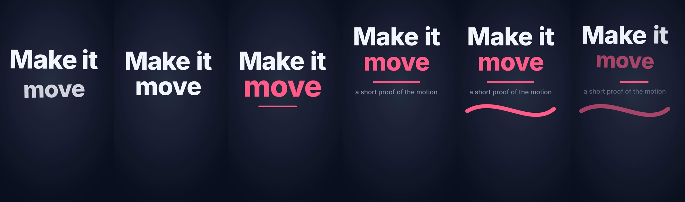
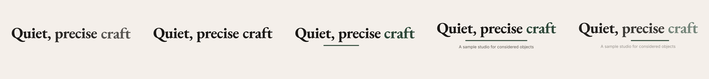
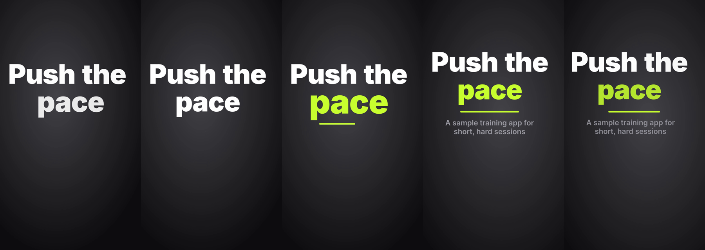
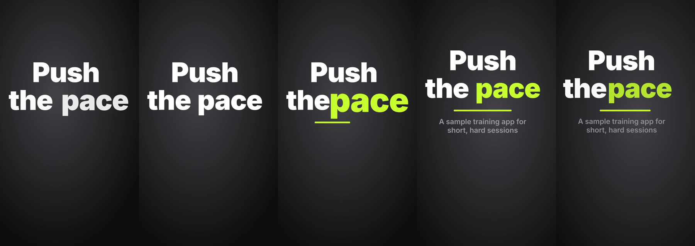
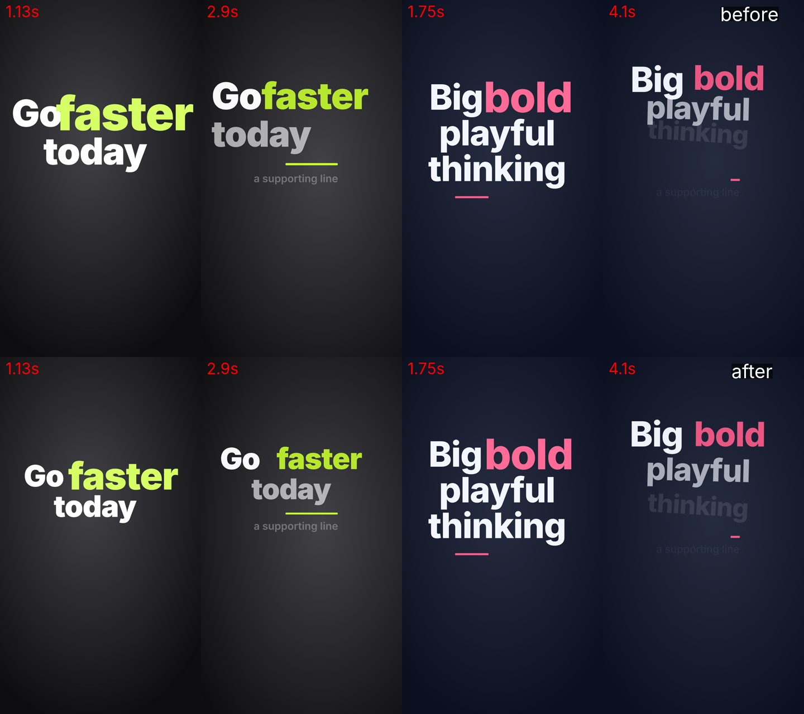
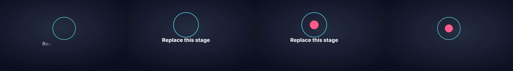

# Motion identity proofs: what they play, and the evidence for PR #64

For whoever maintains [`motion-identity`](../../skills/motion-identity/SKILL.md). It covers what `motion.mjs proof` plays, how the motion tests attached to [PR #64](https://github.com/MathBorgess/skills-catalog/pull/64) were produced, and the layout defect they found. The run contract is [`references/delivery.md`](../../skills/motion-identity/references/delivery.md); this page does not repeat it.

| Part | Status |
| --- | --- |
| `motion.mjs proof`: plan, page, `hyperframes check`, render, frames, contact sheet | **shipped** |
| Room for the emphasis, and an exit that travels as one block (the fix below) | **shipped** in PR #64 |
| The Playwright geometry probe used to find the defect | **not shipped**. It was a maintainer tool in a scratch folder, described here only |
| The evidence on this page | recorded on 2026-10-06 with HyperFrames 0.8.137 |

## What a proof plays

[`scripts/lib/proof.mjs`](../../skills/motion-identity/scripts/lib/proof.mjs) plans every time and ease from the spec alone. [`assets/proof.html`](../../skills/motion-identity/assets/proof.html) only runs the plan. In order:

1. A 0.3 s lead-in, so the first motion is not a jump cut.
2. The headline words enter one by one, in reading order. Each comes from where no word is yet, in the archetype's pattern (`CHOREOGRAPHY[personality].from` → `.to`), on `eases.enter`, staggered by the archetype's word stagger.
3. One word is emphasized. It scales to the archetype's peak on `eases.emphasis`, settles back on `power2.out` and takes the accent color.
4. A rule draws on `eases.enter`, and the supporting line fades in.
5. The group moves on the base `ease`.
6. The signature plays for 1.8 s, if `--signature` names one.
7. The exit: together, last word first, on `eases.exit`. The headline travels as one block (`.away`), and each word plays `.out` (shrink, turn, fade) in reverse order.
8. A 0.5 s end hold. The ambient glow follows `motion.ambient` throughout.

The frames are taken at those moments: `entrance`, `settled`, `emphasis`, `moved`, `signature` (when there is one) and `exit`. The contact sheet puts them side by side.

## How this evidence was produced

- **Environment.** Node 22.22.0. HyperFrames 0.8.137 through `npx --yes hyperframes@latest`, with `PRODUCER_HEADLESS_SHELL_PATH` pointing at an installed Chrome headless shell (Playwright's build 1194). GSAP 3.14.2 from jsDelivr, so the render had network access. ffmpeg for the frames.
- **Brands.** Three generic sample brands, written for this test. None is a real brand.

| Sample | Personality | `eases` enter / exit / emphasis; `ease` | Ambient | Palette (background, text, accent used) | Display type |
| --- | --- | --- | --- | --- | --- |
| playful | `playful` | `back.out(1.6)` / `power3.in` / `back.out(2.2)`; `power2.inOut` | `subtle` | `#0B1020`, `#F4F6FF`, `#FF5C8A` | Inter 800 |
| premium | `premium` | `power3.out` / `power2.in` / `power2.out`; `sine.inOut` | `none` | `#F4F1EA`, `#1C1B19`, `#2F4A3A` | Liberation Serif 700 |
| energetic | `energetic` | `expo.out` / `expo.in` / `back.out(3)`; `power3.inOut` | `lively` | `#0E0E10`, `#FFFFFF`, `#C8FF2E` | Inter 900 |

The premium and energetic durations are the rows for their archetype in [`personality-and-timing.md`](../../skills/motion-identity/references/personality-and-timing.md). The playful signature is the ribbon example in `delivery.md`, plus one stroke-width swell on `eases.emphasis`. Each spec passed `motion.mjs check` and `explain.mjs design check` before its proof ran.

```bash
export PRODUCER_HEADLESS_SHELL_PATH=<chrome-headless-shell>
node skills/motion-identity/scripts/motion.mjs proof <scratch>/playful/DESIGN.md --text "Make it move" \
  --sub "a short proof of the motion" --orientation portrait --signature <scratch>/playful/signature.js --dest <scratch>/playful-portrait
node skills/motion-identity/scripts/motion.mjs proof <scratch>/premium/DESIGN.md --text "Quiet, precise craft" \
  --sub "A sample studio for considered objects" --orientation landscape --dest <scratch>/premium-landscape
node skills/motion-identity/scripts/motion.mjs proof <scratch>/energetic/DESIGN.md --text "Push the pace" \
  --sub "A sample training app for short, hard sessions" --orientation portrait --dest <scratch>/energetic-portrait
```

## Results

| Proof | Frame | Length | `hyperframes check` | Render (wall) | Frames | Accent (default pick) | Emphasis reach |
| --- | --- | --- | --- | --- | --- | --- | --- |
| playful, with signature | portrait 1080×1920 | 6.18 s | 0 errors, 0 warnings | 48 s | 6 | `accentPink` | 1.208 |
| premium, no signature | landscape 1920×1080 | 6.14 s | 0 errors, 0 warnings | 41 s | 5 | `accentPine` | 1.03 |
| energetic, no signature | portrait 1080×1920 | 3.50 s | 0 errors, 0 warnings | 34 s | 5 | `accentLime` | 1.275 |

Every frame was opened and checked for a word cut at the edge, overlapping words, an emphasis pushing into the next line, an unreadable accent, a signature crossing the words and an empty frame. None remains.

**Playful portrait, ribbon signature**



**Premium landscape, no ambient, no signature**



**Energetic portrait, ambient lively**



## The defect the proofs found, and the fix

The first energetic render passed `hyperframes check` with 0 errors and 0 warnings. Its emphasis and exit frames still read "thepace":



HyperFrames sees the headline as one text block, so it cannot see one word run into another. A Playwright probe seeked each page every 1/30 s and measured every word's glyph ink, mapped through its live transform. It found two causes:

1. **The emphasis reach was not reserved.** The layout fitted words at rest. The emphasis scales one word to the archetype's peak, and an overshooting ease goes past that peak: `back.out(3)` reaches 1.25 of its tween, so energetic's 1.22 becomes 1.275. The word ran into its neighbor and past the safe box: 65 px into the right edge zone of a portrait frame, where the platform's buttons sit.
2. **The exit crossed words still on screen.** "Last word first" ([`choreography-and-type.md`](../../skills/motion-identity/references/choreography-and-type.md)) means the last word leaves while the others wait. Energetic sent each word left by 90% of its own width, over the word before it. Playful sent each word up, so a bottom line rose into the line above.

The fix changes geometry only. Peaks, eases, directions and the order stay as the references set them.

- `planProof` computes `emphasisReach`: the peak times the ease's overshoot. `easePeak` uses GSAP's own back and elastic formulas. Its peaks equal those of `gsap.parseEase` on 17 eases, with a difference of 0.
- The page gives the emphasized word a margin only on the sides where a word or a line sits next to it. At the peak, a word space stays at 0.16 em or more and a line gap at 0.04 em or more. The emphasized word's grown ink also has to fit the safe width when the font size is chosen.
- The exit moves the headline as one block (`CHOREOGRAPHY[*].away`). Each word keeps its own shrink, turn and fade, in reverse order.
- The plan is inlined on one line. With the fix, the page had grown past the 300 lines where HyperFrames' `composition_file_too_large` lint warns.

`motion.test.mjs` pins all four:

- the ease peaks;
- the reach in the plan;
- that no exit word travels on its own;
- that the plan sits on one line.

The geometry itself needs a browser, so the probe checked it on stress headlines: 13 with the old template, and the same 13 plus the proofs' own 3 with the new one. They cover the four archetypes, both orientations, middle accents, six words, and descenders over ascenders.

| Headline (accent) | Archetype, frame | Before: overlap at emphasis / exit, emphasis outside safe box | After |
| --- | --- | --- | --- |
| Go **faster** today | energetic, portrait | 28 px / 93 px, 78 px | 0 / 0, 0 |
| Run hard rest **well** go again | energetic, portrait | 9 px / 136 px, 0 | 0 / 0, 0 |
| Push the **pace** | energetic, landscape | 4 px / 64 px, 0 | 0 / 0, 0 |
| **Unstoppable** momentum | energetic, portrait | 2 px / 0, 85 px | 0 / 0, 0 |
| Learn by **playing** with things | playful, landscape | 20 px / 59 px, 35 px | 0 / 0, 0 |
| Big **bold** playful thinking | playful, portrait | 0 (word space 0.12 em) / 71 px, 0 | 0 (0.16 em) / 0, 0 |
| Keep playing **highly** | playful, portrait | 11 px / 30 px, 0 | 0 / 0, 0 |
| 3 corporate and 2 premium headlines; Make it **move** (playful, landscape) | | 0 / 0, 0 | 0 / 0, 0 |

What the probe still reports is only motion past an edge:

- energetic words sliding in from beyond the right edge;
- a whole headline leaving the frame;
- playful's entrance overshoot touching a neighbor by 11 px or less, which no frame shows.



## explain-me with a motion identity (silent)

German has no Kokoro voice, so the run is silent and the timing comes from 150 words per minute. The run used the playful sample spec. Its stage is the placeholder, plus one dot.

```bash
EXPLAIN_ME_HOME=<scratch>/em-home node skills/explain-me/scripts/explain.mjs new --slug kit-proof --lang de --design <scratch>/playful/DESIGN.md
# b01: draw #subject, write #subject-label, at(1.6) indicate #subject, at(2.4) camera { zoom: 1.1 }
# b02: grow #dot, at(0.8) fade #subject-label { out: true }, at(1.4) indicate #dot, at(2.2) camera { reset: true }
EXPLAIN_ME_HOME=<scratch>/em-home node skills/explain-me/scripts/explain.mjs voice <run>
EXPLAIN_ME_HOME=<scratch>/em-home node skills/explain-me/scripts/explain.mjs check <run>    # hyperframes check: 0 errors, 0 warnings
EXPLAIN_ME_HOME=<scratch>/em-home node skills/explain-me/scripts/explain.mjs render <run>   # 10.6 s, rendered in 17.1 s, silent
```

`new` printed the resolved line `motion: personality playful; eases enter back.out(1.6), exit power3.in, emphasis back.out(2.2); ambient subtle; signature "ribbon sweep"`, and one override (`motion.ambient: "none" -> "subtle"`). The browser read each tween's ease off the registered timeline:

| At | Call | Target | Ease in the browser | Role it should take |
| --- | --- | --- | --- | --- |
| 0.5 s | `draw` (0.9 s) | `#subject` | `back.out(1.6)` | `eases.enter` |
| 1.4 s | `write` | `#subject-label` characters | `power1.out` | none: `write` fades each character, and `ease` has no effect on it ([`video-motion.md`](../../skills/explain-me/references/video-motion.md)) |
| 2.1 s | `indicate` | `#subject` | `back.out(2.2)` | `eases.emphasis` |
| 2.9 s | `camera { zoom }` (1.6 s) | `#stage` | `power2.inOut` | `ease` |
| 4.8 s | `grow` (0.6 s) | `#dot` | `back.out(1.6)` | `eases.enter` |
| 5.6 s | `fade { out: true }` (0.5 s) | `#subject-label` | `power3.in` | `eases.exit` |
| 6.2 s | `indicate` | `#dot` | `back.out(2.2)` | `eases.emphasis` |
| 7.0 s | `camera { reset }` (2.6 s) | `#stage` | `power2.inOut` | `ease` |
| 0 s | ambient glow (10.6 s) | `#em-ambient` | `sine.inOut` | `motion.ambient: subtle` |

The durations are the spec's own (`draw` 0.9, `grow` 0.6, `fade` 0.5). The frames, from left to right, are `b01-in`, `b01`, `b02-in` and `b02`:



## Test counts

`npm run check` on the branch, after the fix:

| Suite | Result |
| --- | --- |
| `scripts/check-catalog.mjs` | ok: 7 skills, plugin 2.6.0 |
| `skills-evaluate` | 32 passed |
| `still-cursor-living-day` | 147 passed |
| `explain-me` (`ste-lint.test.mjs`, `explain.test.mjs`) | 113 + 445 passed |
| `motion-identity` (`motion.test.mjs`) | 96 passed (81 before the fix, plus 15 new) |
