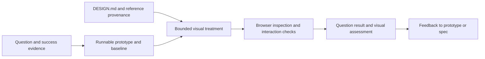

# Prototype and prettify: source investigation

**Observed:** 2026-10-10. **Status:** the investigation's bounded source evidence informed `prettify`, implemented on the MAT-265 branch; [PR #67](https://github.com/MathBorgess/skills-catalog/pull/67) is open for review. The branch includes [the skill entrypoint](../../skills/prettify/SKILL.md); it is not yet published on `main`. This note preserves what was inspected and what remains unverified.

This study examined how references, agent instructions and supporting tools could help an agent produce a prototype under a shared `DESIGN.md`. The resulting operator covers interactive web interfaces and static pieces, including thumbnails, photos and Instagram carousels. It separates implementation mechanics from evidence that a design is effective. The source observations below remain bounded by the evidence table.

## Evidence boundary

| Subject | Evidence | Limit |
| --- | --- | --- |
| This catalog | `f56f051bb196ace4e0e8f44cfdd88f367f99d5b6`, equal to fetched `origin/main` at inspection | Existing contracts, not a new workflow |
| Matt Pocock prototype | Installed plugin 1.2.3; `SKILL.md`, `UI.md`, `LOGIC.md` byte-identical to upstream commit `49dd158d1076134a641b33efb035946536778336` | Instructions inspected; prototype not executed |
| Impeccable installation | Skill metadata 4.5.1; launcher version file 0.1.12; bundled executable reported 4.0.0 | Only help/version executed; no detector, context command or redesign run |
| Impeccable upstream | `d631a8827f99414d2b6daba4ef08b7f8701751d7` | Source inspected; not established as the installed binary's build commit |
| Transitions.dev | `f6e974e5685a97b25b0344b3afb0ccb43f505e43` | Source inspected; no installation, provider call or browser integration |
| Godly, Animos, Deck.gallery | Official pages and exposed website content | No official source repository established in this bounded investigation |

No observed experiment here establishes that these resources cause better designs, faster work, successful user tasks or conversion gains. Website claims remain claims. Script success and clean detector output cannot substitute for a rendered interaction or an answer to the prototype's question.

## What each resource contributes

| Resource | Role | Transferable mechanism |
| --- | --- | --- |
| [Godly](https://godly.design/) | Curated interface references | Give the agent something concrete to inspect; extract hierarchy, composition and spacing decisions with provenance |
| [Transitions.dev skill](https://transitions.dev/skill.html) | Interaction recipes and integration instructions | Route an element and its behavior to one detailed recipe; use semantic motion tokens |
| [Animos](https://animos.app/) | Showcase-video tool | Present an already built interface through images/video; distinct from implementing interaction motion |
| [Deck.gallery](https://www.deck.gallery/pricing/) | Deck and slide reference library | Learn narrative order and presentation composition; reference access differs from editable templates |
| [Impeccable](https://github.com/pbakaus/impeccable/tree/d631a8827f99414d2b6daba4ef08b7f8701751d7) | Design playbooks plus supporting engine | Resolve persistent context, make a specific intervention, inspect implementation and rendered results |
| [Matt's prototype](https://github.com/mattpocock/skills/blob/49dd158d1076134a641b33efb035946536778336/skills/engineering/prototype/SKILL.md) | Throwaway code that answers a question | Make alternatives and state visible; retain the question, verdict and primary artifact |

The image's counts and free-access claims are not stable contracts. Transitions' homepage advertises 43+, its skill page 27+, while the inspected skill indexes 35 recipes and still describes 32. Deck.gallery's free access covers today's deck and six slides from each archived deck; full archive access is paid. These differences do not establish implementation quality.

## Matt's prototype: validation by making the question runnable

The entry skill selects between logic/state exploration and UI exploration. Logic produces a shareable HTML demo with visible state, free play and guided scenarios. UI produces structurally different alternatives on a common route, using the existing page and component system where possible. Its default is three alternatives, capped at five.

Useful design constraints from [UI.md](https://github.com/mattpocock/skills/blob/49dd158d1076134a641b33efb035946536778336/skills/engineering/prototype/UI.md#L34): alternatives differ in hierarchy, layout or primary affordance, not merely color. Holding data and context constant makes comparison meaningful. The switcher is a prototype control, separate from the interface being judged.

The entry skill explicitly skips polish and production machinery. [LOGIC.md](https://github.com/mattpocock/skills/blob/49dd158d1076134a641b33efb035946536778336/skills/engineering/prototype/LOGIC.md#L39) still asks for restrained visual clarity. Therefore, “skip polish” is not a requirement to make an unreadable artifact; it protects the learning goal from expanding into production work.

**Implemented adaptation:** the skill retains the validation question and observable state while applying a bounded visual treatment. It keeps question results separate from visual assessment. This is the catalog's workflow decision, not an upstream rule or evidence that the treatment improves outcomes.

## Impeccable: context, focused judgment and mechanical checks

The installed entry skill routes to specific playbooks. Its supporting launcher handles mechanical operations; the help output listed `detect`, `ignores`, `help`, `install`, `link`, `update` and `check`. `polish` and `bolder` are agent workflows, not standalone CLI redesign verbs. No `impeccable` executable was found on this session's `PATH`, but the installed launcher ran its bundled executable successfully for help/version.

The inspected installed references separate:

- `init`: product context in `PRODUCT.md`, without inventing identity.
- `document`: visual-system documentation or a seed before code; normative tokens plus explanatory prose.
- `bolder`: stronger hierarchy, composition and an existing visual motif.
- `polish`: functional and cosmetic defects, state coverage, device inspection and consistency with the design contract.

In the installed `reference/document.md` (lines 43–62 and 356–383), `DESIGN.md` uses frontmatter keys including `colors`, `typography`, `rounded`, `spacing` and `components`. Its prose describes application. A `.impeccable/design.json` sidecar holds extensions without duplicating those primitive tokens. A surface brief holds page-specific purpose and composition rather than turning them into global rules.

Upstream evidence:

- [Context resolver, lines 101–140](https://github.com/pbakaus/impeccable/blob/d631a8827f99414d2b6daba4ef08b7f8701751d7/crates/context/src/context.rs#L101): loads product/design context and resolves a target brief.
- [Context CLI, lines 622–675](https://github.com/pbakaus/impeccable/blob/d631a8827f99414d2b6daba4ef08b7f8701751d7/crates/context/src/context_cli.rs#L622): prints context and scope guidance, including missing-context cases.
- [Design detector, lines 173–200 and 1848–2015](https://github.com/pbakaus/impeccable/blob/d631a8827f99414d2b6daba4ef08b7f8701751d7/crates/detect/src/design_system.rs#L173): discovers the spec and checks declared values against implementation.

The [official changelog](https://impeccable.style/changelog/) records version-number convergence in 4.5.2 on October 9. That provides context for separate older artifact versions; it does not prove the installed executable's provenance. No update was performed. Historical `.impeccable.md` / `teach-impeccable` advice was not found in the inspected installation; `teach` there aliases `init`.

## Transitions.dev: selective recipes rather than free-form motion

The [skill index and routing rules](https://github.com/Jakubantalik/transitions.dev/blob/f6e974e5685a97b25b0344b3afb0ccb43f505e43/skills/transitions-dev/SKILL.md#L15) select a reference using the visible element and behavior. [Token mapping, lines 123–183](https://github.com/Jakubantalik/transitions.dev/blob/f6e974e5685a97b25b0344b3afb0ccb43f505e43/skills/transitions-dev/SKILL.md#L123) uses motion purpose before numerical similarity. The useful unit is a state transition with a purpose, not a request to animate everything.

[The modal recipe](https://github.com/Jakubantalik/transitions.dev/blob/f6e974e5685a97b25b0344b3afb0ccb43f505e43/skills/transitions-dev/06-modal.md#L13) supplies hooks, open/closing states and reduced-motion handling. It does not by itself establish accessible focus management, Escape handling or background behavior. Those remain integration responsibilities.

[The CLI, lines 104–148](https://github.com/Jakubantalik/transitions.dev/blob/f6e974e5685a97b25b0344b3afb0ccb43f505e43/cli/bin/transitions-dev.mjs#L104) writes Markdown recipes; recipe delivery is not working component integration. [The build extractor](https://github.com/Jakubantalik/transitions.dev/blob/f6e974e5685a97b25b0344b3afb0ccb43f505e43/build/extract.mjs#L66) links showcase templates to generated skill payloads, reducing duplicated sources.

[Refine](https://github.com/Jakubantalik/transitions.dev/blob/f6e974e5685a97b25b0344b3afb0ccb43f505e43/refine/README.md#L3) uses a browser, local relay and agent to propose live overrides before accepted edits reach source. This is source-observed architecture, not an executed integration in this study.

[The scan score](https://github.com/Jakubantalik/transitions.dev/blob/f6e974e5685a97b25b0344b3afb0ccb43f505e43/agent/lib/scan.mjs#L8) subtracts hand-authored penalties from 100. It measures compliance with its rules, not learned taste. A global reduced-motion occurrence check also cannot prove that every interaction respects the preference.

[The license](https://github.com/Jakubantalik/transitions.dev/blob/f6e974e5685a97b25b0344b3afb0ccb43f505e43/skills/transitions-dev/LICENSE.txt#L4) permits project use but restricts republishing the collection or a substantial part as a competing library/kit. Proposed public skill content should be original guidance; external recipes can be referenced or consumed from an installed provider instead of vendored wholesale.

## Existing catalog compatibility

The catalog already defines [Design Spec and Brand Spec](../../GLOSSARY.md) and implements [motion-identity](../../skills/motion-identity/SKILL.md) and [explain-me's design contract](../../skills/explain-me/references/design-spec.md). [ADR 0004](../../.agents/adr/0004-motion-identity-over-imports.md) records why motion identity belongs in one brand spec rather than imported overlapping skills.

A new consumer should preserve existing frontmatter and sections. UI motion values use a different runtime from GSAP-based video primitives; CSS milliseconds/easings must not silently overwrite video seconds/GSAP names. Token extraction, spec resolution and adapters are design questions still open. No second catalog index or competing brand-spec file has been created.

## Implemented workflow contract

The flow below is implemented in [`prettify`](../../skills/prettify/SKILL.md). It represents its contracts, not evidence of measured design improvement.

Three results should remain distinguishable: what the prototype taught us, whether its behavior was preserved, and whether the visual treatment follows the spec. A screenshot can support a visual finding; it does not establish that the interaction or product hypothesis works.

Potential `DESIGN.md` concerns to discuss: audience and intended impression; reference decisions with provenance; hierarchy and density; visual tokens; interaction states and purposeful motion; responsive behavior; reduced-motion behavior; explicit forbidden patterns. These are proposed concerns, not a new parser schema or shipped template.

## Resolved workflow decisions

| Decision | Recommendation | State |
| --- | --- | --- |
| Workflow ownership | `prettify` conducts the cycle and can receive an existing prototype | Accepted by user: complete cycle |
| Initial surface | Interactive web interfaces | User expanded scope: web plus static images, including thumbnails, photos and Instagram carousels |
| Validation contract | Explicit question result plus visual assessment | Accepted by user; real-user study is not automatically required |
| Design context | Read existing `DESIGN.md`; construct an initial one when absent | Accepted: authoritative reference; absent file requires a reference-backed draft and human decision |
| Dependencies | Standalone workflow with optional upstream resources | User changed policy: required extra resources may be dependencies; offer installation when absent, stop if refused |
| Visual choice | Three distinct directions coherent with the design spec | User selected designer stages: briefing, low fidelity, high fidelity, delivery; explicit user skips are allowed with reduced-control trade-off |
| Dependency scope | Require only resources needed by the current task | Accepted by user: task-specific dependencies |
| Web delivery | Implemented and navigable interface in the project | Accepted by user: implemented interface |
| Reference approval | Separate acceptance for one artifact from durable inclusion in `DESIGN.md` | Accepted by user: use and inclusion are separate choices |

The accepted stage model is recorded in [workflow.md](workflow.md) and implemented in the skill. The MAT-265 issue tracks the request and [PR #67](https://github.com/MathBorgess/skills-catalog/pull/67) carries the catalog implementation for review. The glossary records the workflow terms and the distinction between question result and visual assessment.

For static pieces, the skill uses visual variants holding the message and intended audience constant. The comparison concerns composition, legibility and intended impression rather than application state. Photos, thumbnails and carousels use medium-specific considerations: image direction/crop, display scale and slide sequence. No production pilot for those media has been completed as part of this source investigation.

## What remains unverified

- End-to-end operation of Impeccable and Transitions on the same project.
- Runtime interpretation of a shared spec across the installed providers.
- A controlled comparison of baseline and treated prototypes.
- User-task outcomes and owner preference on actual rendered artifacts.
- End-to-end behavior of the catalog skill on a real project, beyond structural tests and synthetic fixtures.
- Whether the staged workflow improves design quality, task outcomes, user preference, or time.
