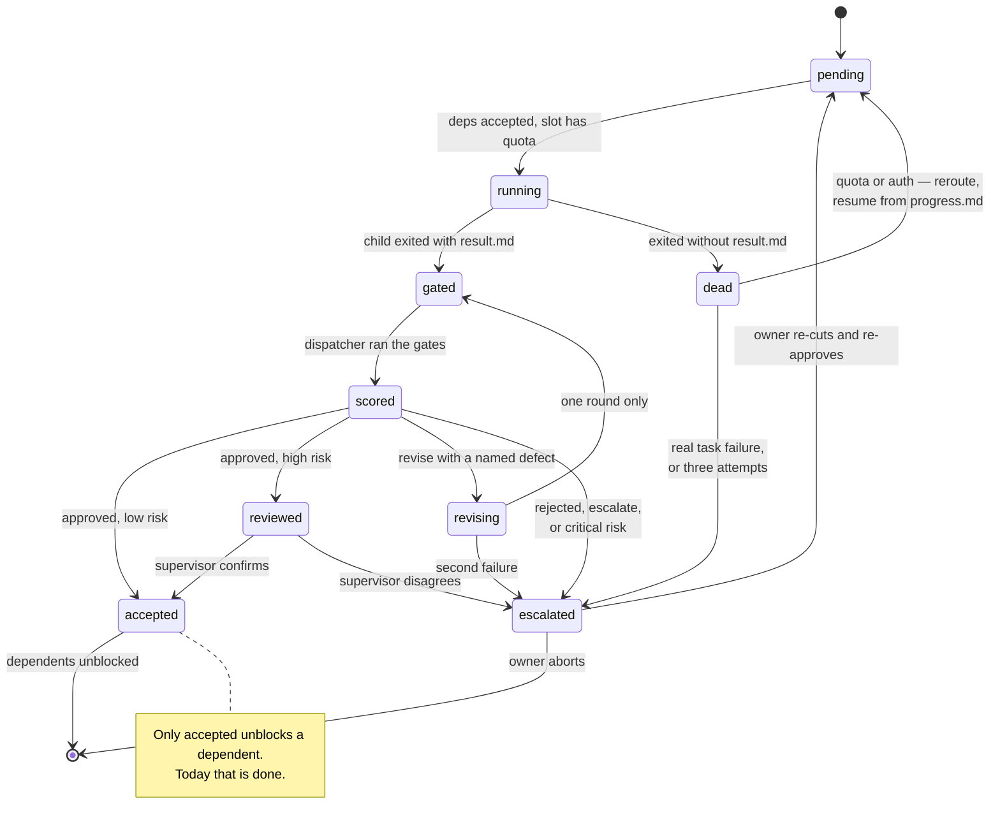

# Handoff mechanism — sequence, gates and the session graph

How a handoff run actually behaves, end to end. Vocabulary is defined in [`CONTEXT.md`](../../../CONTEXT.md); the roadmap these diagrams anticipate is [#31](https://github.com/MathBorgess/skills-catalog/issues/31).

> **Read this first.** Phases 1–4, the digest and the scorecard are what the skill does **today**. The acceptance phase, the environment preflight, the escalation gate, the teacher and every scorer are **roadmap** — they are drawn because the diagram is the design. Do not follow a roadmap box while executing a run: if a command or a state below is not in `SKILL.md`, it does not exist yet.

| Part | Status |
| --- | --- |
| Phases 1–4, digest, scorecard | **shipped** |
| HITL-1 graph gate with hash lock | **shipped**, and mandatory |
| Capability gate | **shipped** — the gate is code; the declaration is prose |
| Phase 5 acceptance: gate run, verdict, risk, matrix | roadmap (#34, #38, #39, #40) |
| HITL-0 environment preflight | roadmap (#44) |
| Scorers at any site | roadmap (#32, #35, #36, #37, #42, #43) |
| Teacher | roadmap (#47) |

## The three human gates

| Gate | Fires when | Today |
| --- | --- | --- |
| **HITL-0 — admission** | `route` refuses: write-set collision, no provider satisfies the declared capabilities, environment precondition unmet | partial; the environment half is #44 |
| **HITL-1 — graph gate** | after cutting and routing, **before any launch**. The owner grills the graph; `route --approve` locks the plan hash | **shipped and mandatory** |
| **HITL-2 — escalation** | `critical` risk, `rejected` brief, `escalate` verdict, or a spent revise round | roadmap (#40) |

HITL-1 is the defence against the one failure no per-session check can catch: a wrong premise propagated into every brief at once. The recorded case is a supervisor that oriented itself on a tree 37 commits behind `origin`, so six documents described the wrong milestone.

## Sequence

```mermaid
sequenceDiagram
    autonumber
    actor H as Owner
    participant S as Supervisor
    participant HF as handoff.mjs
    participant S1 as Scorer
    participant C as Child
    participant G as Gate run
    participant T as Teacher

    Note over H,S: PHASE 1 — activation
    alt human-invoked
        H->>S: /handoff, "fan this out", "compact this"
    else model-invoked
        Note over S: the skill description matches the<br/>request in flight; the model loads it
    end

    Note over S,HF: PHASE 2 — probe, cut, route
    S->>HF: probe --run
    HF-->>S: supply per lane and per window
    S->>S1: goal -> tier, size
    S->>S1: goal -> capabilities, one per question
    S1-->>S: typed decisions with p
    Note over S1: below threshold it abstains;<br/>it never invents a value
    S->>HF: write plan.json
    S->>HF: route --run
    HF->>HF: environment preflight and capability gate

    alt plan not admitted
        HF-->>S: refusal, with the remedy named
        S->>H: HITL-0
        H-->>S: fix the cut or the environment
    end

    HF-->>S: lanes, estimates, override warnings

    Note over S,H: PHASE 3 — graph gate, HITL-1, mandatory
    S->>H: graph, concurrency, lanes,<br/>predicted vs declared capabilities
    H-->>S: grilling
    H->>S: approved
    S->>HF: route --approve, locks the plan hash

    Note over S,C: PHASE 4 — briefs and dispatch
    S->>S: write NN.md and NN.prompt.md
    S->>HF: dispatch --budget --settle

    loop each session whose deps are accepted
        HF->>C: launch on the assigned lane
        activate C
        C->>S1: must this command's output arrive whole?
        C->>S1: this file — at which read level?
        C->>C: work, append to progress.md
        C-->>HF: exit, write result.md
        deactivate C
    end

    Note over HF,G: PHASE 5 — acceptance: where done becomes accepted
    HF->>G: run the plan's verify commands in the worktree
    G-->>HF: evidence, not a conclusion
    HF->>HF: deterministic features:<br/>diffstat, scope creep, gate disagreement
    HF->>S1: result digest + Done when + features
    S1-->>HF: verdict and risk level
    HF->>HF: attention matrix

    alt approved, routine risk
        HF->>HF: unblock dependents — no supervisor turn
    else approved, high risk
        HF->>S: digest, plus the diff when critical
        S-->>HF: confirms
    else revise, with a named defect
        HF->>C: fresh session, same worktree, new brief
        activate C
        C-->>HF: correction
        deactivate C
        HF->>G: re-run the gates
        Note over HF: one round only.<br/>Failed again means escalate
    else rejected, escalate, or round spent
        HF->>S: escalate
        S->>H: HITL-2
        H-->>S: re-cut, approve, or abort
    end

    Note over HF,T: PHASE 6 — scorecard and learning
    HF->>HF: score: resolve outcomes,<br/>write metrics.jsonl and decisions.jsonl
    Note over T: after the run, batched,<br/>on the abundant lane
    T->>T: mine free labels from outcomes
    T->>T: label only the silent half
    T-->>S1: dataset — never an action
```

## A session node

The change that matters is not the happy path: it is that **`done` stops being terminal**. Today `done` is the child asserting it finished, and dependents start behind that assertion.



Three properties follow:

1. **A dependent never starts behind an unaccepted session.** Strictly stronger than `status === "done"`.
2. **`dead` is not `failed`.** Three sessions in one run exited without a result while holding real work — 711 lines in one case. Relaunching from a clean worktree would destroy it, so `dead → pending` **resumes from progress**.
3. **`escalated` is a state, not an ending.** The owner re-cuts and the node returns to `pending` under a re-approved hash.

## Every session is a fresh session

`dispatch` launches a child as a new CLI process reading `NN.prompt.md`. **No conversation survives a relaunch** — what persists is the worktree and `progress.md`. That is a property to preserve deliberately, not an accident:

- **A revise round gets a new brief, not the original one.** Re-sending the original re-injects the supervisor's first hypothesis, and the run record shows that hypothesis being wrong while the child was right: *the diagnosis written in the brief is a hypothesis; the child was correct to follow the evidence instead of the supervisor's theory.* The revise brief carries the **named defect** — gate output, a diffstat fact, a missed `Done when` item — and states that a previous attempt is on disk.
- **A review session is never the author's session, and should not be the author's model.** Read-only, artefacts only, never the child's transcript. Running it on a different provider from the author is the cheapest independence available, and run `20260915T182254Z` got it by accident: the review ran on Codex and returned NO-GO on a tree with 159 green tests.

## Where context is spent, and where it is not

The design's answer to long-context degradation is not better retrieval. It is **shorter contexts and state on disk**. `plan.json`, `NN.md`, `progress.md`, `result.md`, `state.json` and `decisions.jsonl` are the memory; a model's context is a working set.

**Child.** It starts near-empty — `references/brief.md` requires pointers, never pasted artefacts, and the child has no supervisor context. The scorers then govern what is allowed to enter: which commands return whole output, and at which level a file is read. `progress.md` is external memory, so a resumed session re-reads a short file instead of a transcript.

**Supervisor.** It reads the digest and is forbidden from opening `logs/`, a child transcript, or `wt/`. The acceptance phase removes it from the routine path entirely — and that changes the scaling, not the constant. Today its context grows with the **number of sessions**, because it reads every digest and makes every call. With the matrix it grows with the **number of escalations**.

The honest gaps: nothing caps a single child's context growth mid-session — `--budget` bounds wall time, not tokens — and a `critical` session deliberately sends a diff up. The design concentrates context spend on the risky minority rather than eliminating it.
